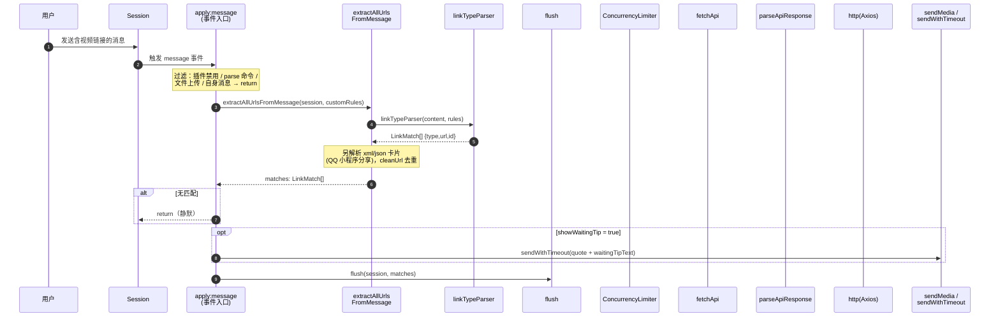
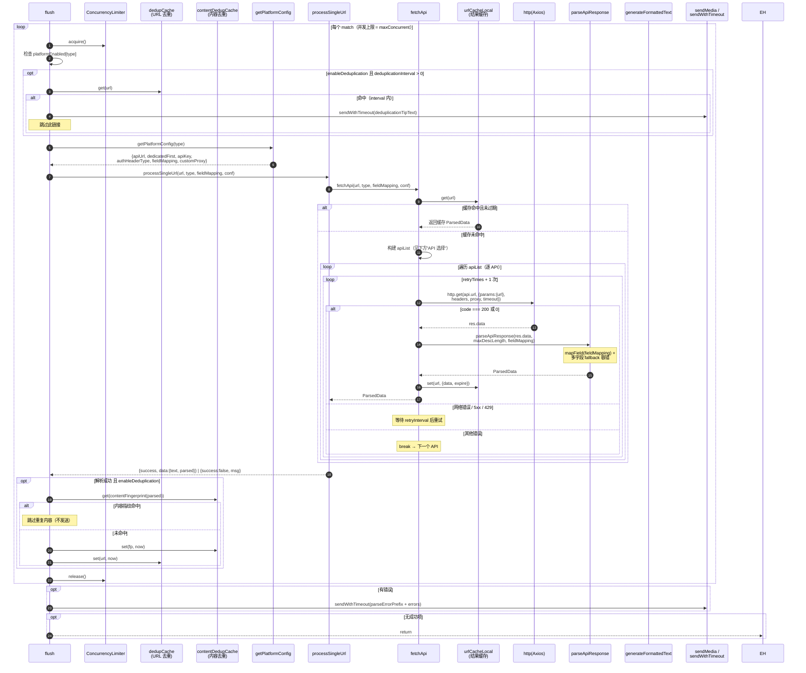
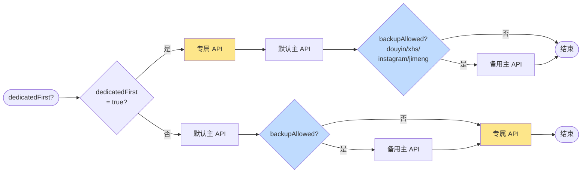
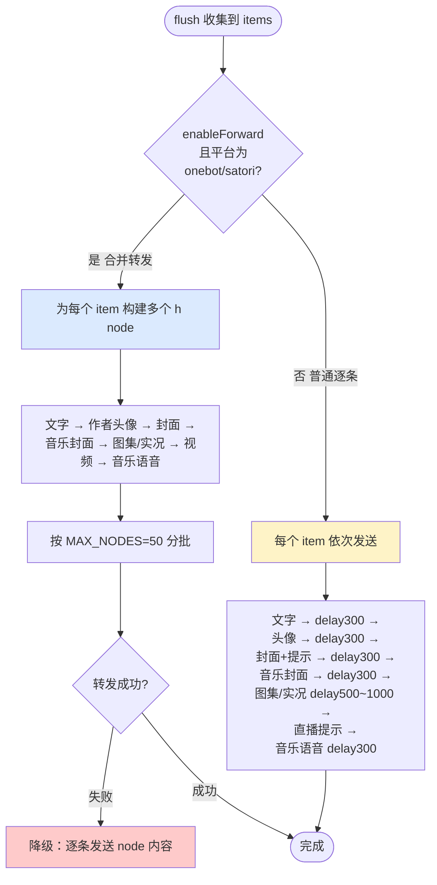

# 通用时序图

完整描述一次视频/图集解析的端到端流程。涵盖：消息接收 → 链接匹配 → 平台识别 → 并发限流 → 去重 → API 调用与重试 → 字段映射 → 缓存 → 结果发送（普通 / 合并转发）。

源码位置：`src/`（拆分后的多模块结构）。

## 模块归属速查

| 流程步骤 | 模块文件 |
|----------|----------|
| 事件入口 / 命令注册 / dispose | `index.ts` |
| 运行期状态构建 | `runtime.ts`（`createRuntime`） |
| 链接匹配 `extractAllUrlsFromMessage` / `linkTypeParser` / `cleanUrl` | `utils/url.ts` |
| 平台配置查询 `getPlatformConfig` | `platforms/custom.ts` |
| 链接规则 `BUILTIN_LINK_RULES` | `platforms/rules.ts` |
| 专属 API 表 `defaultDedicatedApis` | `platforms/dedicated-apis.ts` |
| 解析编排 `flush` / `processSingleUrl` / `parseUrl` / `fetchApi` | `sender/flush.ts` + `engine/fetcher.ts` |
| 统一解析引擎 `parseApiResponse` | `engine/parser.ts` |
| 缓存 / 并发 / 去重 | `utils/cache.ts` + `utils/concurrency.ts` + `utils/common.ts` |
| 字段映射 `getNestedValue` / `parseFieldMapping` | `utils/field-mapping.ts` |
| 文字格式化 `generateFormattedText` | `utils/format.ts` |
| 发送 `sendWithTimeout` / `sendMedia` / `buildForwardNode` | `sender/sender.ts` + `sender/forward.ts` |
| 文案兜底 `getText` | `utils/common.ts` |

## 主流程时序图

## flush 内部：并发、去重、解析、发送

## API 选择逻辑（fetchApi 内 apiList 构建）

顺序由 `getPlatformConfig().dedicatedFirst`（来自 `config.platformDedicatedFirst[type]`）决定：

> 自定义平台（`custom_*`）强制 `dedicatedFirst = true`，仅使用其自定义 `apiUrl`。

## 结果发送分支

## 媒体发送决策（sendMedia）

| 条件 | 行为 |
|------|------|
| `showFile = false`（如 `showCoverFile`/`showImageFileNew`/`showAuthorAvatarFile`/`showMusicVoiceFile` 关闭） | 仅发送 `{类型}链接：{url}` 文本 |
| `showFile = true` 且发送 `h.image/h.video/h.audio` 成功 | 发送媒体元素 |
| `showFile = true` 但发送抛错 | 回退发送 `{类型}链接：{url}` 文本 |

## 关键配置项映射

| 阶段 | 相关配置 |
|------|---------|
| 过滤 | `enable`, `showWaitingTip` |
| 匹配 | `customPlatforms`（生成 customRules） |
| 并发 | `maxConcurrent` |
| 去重 | `enableDeduplication`, `deduplicationInterval` |
| 平台开关 | `platformEnabled[type]` |
| API 选择 | `platformDedicatedFirst[type]`, `customApis`, `primaryApiUrl`, `backupApiUrl` |
| 请求 | `timeout`, `userAgent`, `proxy`, `customHeaders`, `retryTimes`, `retryInterval` |
| 字段映射 | `globalFieldMapping`, `customApis[].fieldMapping`, `customPlatforms[].fieldMapping` |
| 缓存 | `cacheTTL` |
| 格式化 | `unifiedMessageFormat`, `maxDescLength` |
| 发送 | `enableForward`, `showImageText`, `showCoverImage/File/Text`, `showImageFileNew`, `showAuthorAvatar/File/Text`, `showMusicCover`, `showVideoFile`, `showMusicVoice/File`, `sendLiveMessage`, `ignoreSendError`, `videoSendTimeout`, `botName` |
