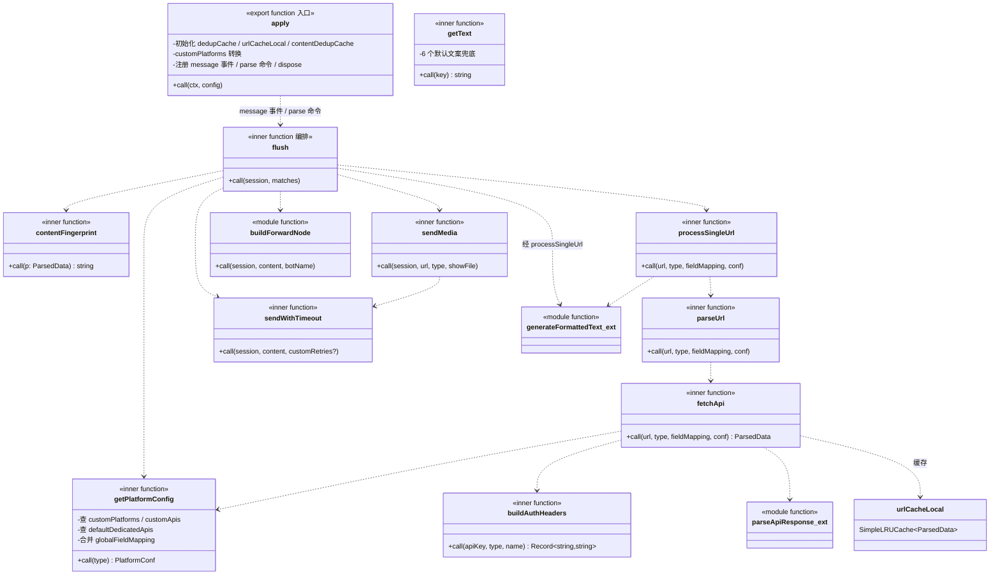
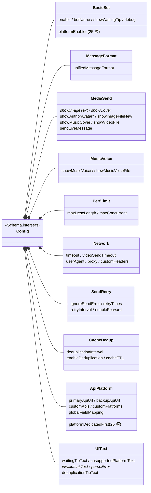

# 通用类图

描述插件的核心类型、数据契约与函数依赖关系。源码位置：`src/index.ts`。

## 类与接口

```mermaid
classDiagram
    direction LR

    class SimpleLRUCache~V~ {
        -map: Map~string,{value,expireAt}~
        +max: number
        +ttlMs: number
        +get(key) V|undefined
        +set(key, value) void
        +clear() void
    }

    class ConcurrencyLimiter {
        -running: number
        -queue: (()=>void)[]
        +max: number
        +acquire() Promise~void~
        +release() void
    }

    class VideoQuality {
        +quality: string
        +url: string
        +bit_rate?: number
    }

    class ParsedData {
        +type: string
        +title: string
        +desc: string
        +author: string
        +uid: string
        +avatar: string
        +cover: string
        +video: string
        +videos: VideoQuality[]
        +images: string[]
        +live_photo: {image,video}[]
        +music: {title?,author?,cover?,url?}
        +like: number
        +comment: number
        +collect: number
        +share: number
        +play: number
        +duration: number
        +publishTime: number
        +author_followers: number
        +author_signature: string
        +admire: number
    }

    class LinkMatch {
        +type: string
        +url: string
        +id: string
    }

    class ApiItem {
        +url: string
        +label: string
        +apiKey?: string
        +authHeaderType?: string
        +customHeaderName?: string
        +fieldMapping?: Record~string,string~
    }

    class CustomPlatformConfig {
        +name: string
        +apiUrl: string
        +apiKey: string
        +authHeaderType: string
        +customHeaderName: string
        +fieldMapping?: Record~string,string~
        +proxy?: any
    }

    ParsedData o-- VideoQuality : videos
    ParsedData o-- "music" MusicInfo
    ParsedData o-- "live_photo" LivePhoto

    class MusicInfo {
        +title?: string
        +author?: string
        +cover?: string
        +url?: string
    }
    class LivePhoto {
        +image: string
        +video: string
    }
```

## 模块级工具函数依赖

```mermaid
classDiagram
    direction LR

    class linkTypeParser {
        <<function>>
        +call(content, customRules) LinkMatch[]
    }
    class cleanUrl {
        <<function>>
        +call(url) string
    }
    class extractAllUrlsFromMessage {
        <<function>>
        +call(session, customRules) LinkMatch[]
    }
    class BUILTIN_LINK_RULES {
        <<const {pattern,type}[]>>
    }
    class buildCustomLinkRules {
        <<function>>
        +call(customPlatforms) {pattern,type}[]
    }

    class parseApiResponse {
        <<function 核心引擎>>
        +call(raw, maxDescLen, fieldMapping) ParsedData
        -mapField(name, fallback)
    }
    class getNestedValue {
        <<function>>
        +call(obj, path) any
    }
    class pickBestQuality {
        <<function>>
        +call(videoBackup) VideoQuality[]
    }
    class parseCount {
        <<function>>
        +call(val) number
    }
    class generateFormattedText {
        <<function>>
        +call(p, format, index?, total?) string
    }
    class formatDuration {
        <<function>>
        +call(seconds) string
    }
    class formatPublishTime {
        <<function>>
        +call(ms) string
    }
    class parseFieldMapping {
        <<function>>
        +call(mappingStr) Record~string,string~ | undefined
    }

    linkTypeParser ..> BUILTIN_LINK_RULES : 默认合并
    linkTypeParser ..> cleanUrl
    extractAllUrlsFromMessage ..> linkTypeParser
    extractAllUrlsFromMessage ..> cleanUrl
    buildCustomLinkRules ..> BUILTIN_LINK_RULES : 输出合并到 customRules

    parseApiResponse ..> getNestedValue : mapField
    parseApiResponse ..> pickBestQuality
    parseApiResponse ..> parseCount
    generateFormattedText ..> formatDuration
    generateFormattedText ..> formatPublishTime
```

## apply 闭包内部依赖（运行期核心）



## Config Schema 结构（10 组 intersect）



## 说明

- **`ParsedData`** 是整个插件的**统一数据契约**：所有平台 API 的响应都经 `parseApiResponse` 规范化为该结构，发送端只依赖它。
- **`parseApiResponse`** 是唯一的解析引擎，通过 `mapField(name, fallback)` 实现「字段映射优先 + 多字段名 fallback 容错」，使一套代码兼容所有平台。
- **平台间无代码差异**：差异仅体现在数据（`BUILTIN_LINK_RULES` 链接规则、`defaultDedicatedApis` 专属 API、`backupAllowed` 白名单、`platformEnabled`/`platformDedicatedFirst` 开关）。
- **多实例隐患**：`debugEnabled`（`index.ts:347`）为模块级 `let`，在 `apply` 内被赋值，多实例会互相覆盖（拆分阶段将修正）。
