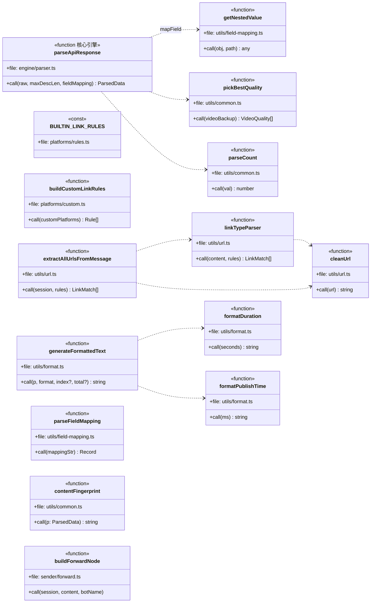
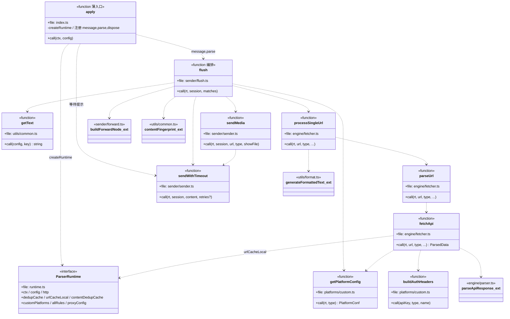
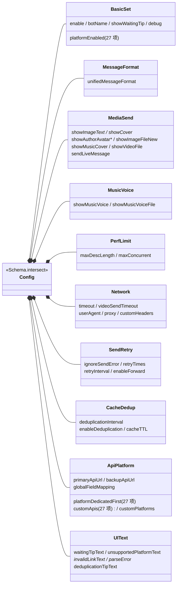

# 通用类图

描述插件的核心类型、数据契约与函数依赖关系。源码位置：`src/index.ts`。

## 类与接口

```mermaid
classDiagram
    direction LR

    class SimpleLRUCache~V~ {
        -map: Map~string,{value,expireAt}~
        +max: number
        +ttlMs: number
        +get(key) V|undefined
        +set(key, value) void
        +clear() void
    }

    class ConcurrencyLimiter {
        -running: number
        -queue: (()=>void)[]
        +max: number
        +acquire() Promise~void~
        +release() void
    }

    class VideoQuality {
        +quality: string
        +url: string
        +bit_rate?: number
    }

    class ParsedData {
        +type: string
        +title: string
        +desc: string
        +author: string
        +uid: string
        +avatar: string
        +cover: string
        +video: string
        +videos: VideoQuality[]
        +images: string[]
        +live_photo: {image,video}[]
        +music: {title?,author?,cover?,url?}
        +like: number
        +comment: number
        +collect: number
        +share: number
        +play: number
        +duration: number
        +publishTime: number
        +author_followers: number
        +author_signature: string
        +admire: number
    }

    class LinkMatch {
        +type: string
        +url: string
        +id: string
    }

    class ApiItem {
        +url: string
        +label: string
        +apiKey?: string
        +authHeaderType?: string
        +customHeaderName?: string
        +fieldMapping?: Record~string,string~
    }

    class CustomPlatformConfig {
        +name: string
        +apiUrl: string
        +apiKey: string
        +authHeaderType: string
        +customHeaderName: string
        +fieldMapping?: Record~string,string~
        +proxy?: any
    }

    ParsedData o-- VideoQuality : videos
    ParsedData o-- "music" MusicInfo
    ParsedData o-- "live_photo" LivePhoto

    class MusicInfo {
        +title?: string
        +author?: string
        +cover?: string
        +url?: string
    }
    class LivePhoto {
        +image: string
        +video: string
    }
```

## 平台无关工具函数依赖（按模块归属）

> 拆分后纯函数分布在 `utils/`、`engine/`、`sender/`、`platforms/`。下图标注各函数所属文件。



## 运行期函数依赖（ParserRuntime 注入）

> 原 `apply` 闭包内的 8 个函数已抽为模块级函数，统一接收 `rt: ParserRuntime`（依赖注入）。`apply` 退化为薄入口。



## Config Schema 结构（10 组 intersect）



## 说明

- **`ParsedData`** 是整个插件的**统一数据契约**：所有平台 API 的响应都经 `parseApiResponse` 规范化为该结构，发送端只依赖它。
- **`parseApiResponse`** 是唯一的解析引擎，通过 `mapField(name, fallback)` 实现「字段映射优先 + 多字段名 fallback 容错」，使一套代码兼容所有平台。
- **平台间无代码差异**：差异仅体现在数据（`platforms/rules.ts` 链接规则、`platforms/dedicated-apis.ts` 专属 API、`engine/fetcher.ts` 的 `backupAllowed` 白名单、`config.ts` 开关）。
- **多实例隐患已修复**：原模块级 `let debugEnabled` 在 `apply` 内被赋值会互相覆盖；现改为 `utils/logger.ts` 的 `setDebugEnabled()`，每个 `apply` 调用时设置（注：仍为模块级单例，多实例共享同一开关——彻底隔离需进一步实例化，但已消除直接赋值的隐式耦合）。
- **依赖注入**：运行期函数统一接收 `ParserRuntime`（`runtime.ts`），解耦了原 `apply` 闭包对局部状态的捕获，便于测试与扩展。
