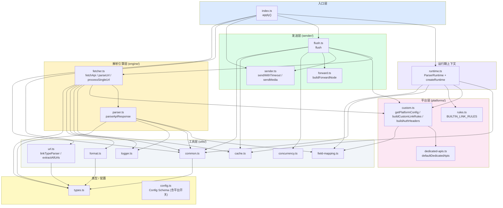
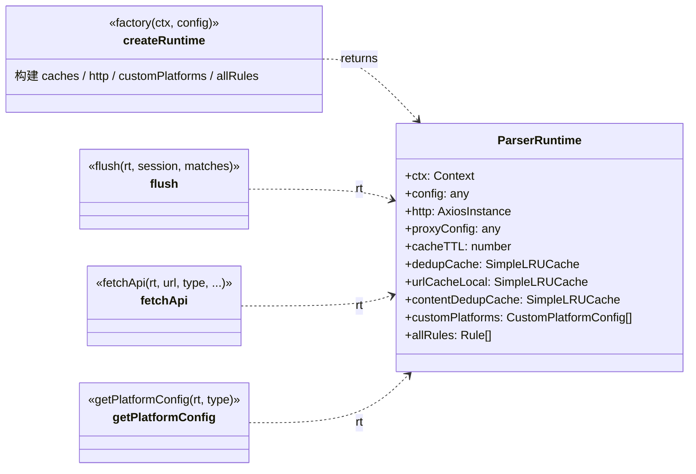

# 架构 / 模块依赖图

> 本图反映 **拆分后** 的多模块结构（`refactor/split-modules` 分支）。原单文件 `index.ts`（1238 行）已按「平台无关 / 平台特定」拆分为 16 个文件。

## 目录结构

```
src/
├── index.ts              # 薄入口（~50 行）：createRuntime + 注册 message/parse/dispose
├── config.ts             # name 常量 + Config Schema（10 组 intersect）
├── types.ts              # 5 个核心 interface
├── runtime.ts            # ParserRuntime 接口 + createRuntime 工厂
├── utils/                # 平台无关工具
│   ├── cache.ts          # SimpleLRUCache
│   ├── concurrency.ts    # ConcurrencyLimiter
│   ├── logger.ts         # logger / debugLog / setDebugEnabled
│   ├── common.ts         # delay / getErrorMessage / parseCount / pickBestQuality / contentFingerprint / getText
│   ├── field-mapping.ts  # getNestedValue / parseFieldMapping
│   ├── format.ts         # formatDuration / formatPublishTime / generateFormattedText
│   └── url.ts            # cleanUrl / linkTypeParser / extractAllUrlsFromMessage（接收 rules，平台无关）
├── engine/               # 解析引擎（平台无关）
│   ├── parser.ts         # parseApiResponse 统一引擎
│   └── fetcher.ts        # fetchApi / parseUrl / processSingleUrl
├── sender/               # 消息发送（平台无关）
│   ├── sender.ts         # sendWithTimeout / sendMedia
│   ├── forward.ts        # buildForwardNode
│   └── flush.ts          # flush 编排
└── platforms/            # 平台特定（数据 + 配置逻辑）
    ├── rules.ts          # BUILTIN_LINK_RULES（27 平台链接规则）
    ├── dedicated-apis.ts # defaultDedicatedApis（专属 API 表）
    ├── custom.ts         # buildCustomLinkRules / buildAuthHeaders / getPlatformConfig
    └── (registry)        # 平台信息现分散于 rules + dedicated-apis + config.ts 三处开关
```

## 分层依赖



## 关键设计：ParserRuntime 依赖注入

原 `apply` 闭包内的 8 个函数（getPlatformConfig / fetchApi / parseUrl / processSingleUrl / sendWithTimeout / sendMedia / flush）依赖大量共享可变状态（config、http、3 个缓存、customPlatforms、proxyConfig、allRules）。拆分后通过 **`ParserRuntime` 上下文对象** 注入，函数签名变为 `(rt, ...args)`。



## 端到端数据流（不变）

```mermaid
flowchart LR
    Msg["用户消息"]
    RT["ParserRuntime"]
    Match["LinkMatch[]"]
    Conf["PlatformConf"]
    Raw["API 原始响应"]
    Parsed["ParsedData"]
    Text["格式化文字"]
    Send["发送"]

    Msg -->|extractAllUrlsFromMessage<br/>(utils/url + rt.allRules)| Match
    Match -->|flush → getPlatformConfig<br/>(platforms/custom)| Conf
    Match -->|fetchApi<br/>(engine/fetcher)| Raw
    Conf -.->|决定 apiList 顺序| Raw
    Raw -->|parseApiResponse<br/>(engine/parser) + fieldMapping| Parsed
    Parsed -->|generateFormattedText<br/>(utils/format)| Text
    Parsed -->|sendMedia / 合并转发<br/>(sender/*)| Send
    Text --> Send
    RT -.->|注入 config/http/cache| Match
    RT -.-> Conf

    style Parsed fill:#fef3c7
    style Conf fill:#fce7f3
    style RT fill:#ede9fe
```

## 平台数据分布（现状，已对齐）

平台信息仍分布在 3 处文件，但 27 个平台在所有表中**已完全对齐**（见 [平台总览](../platforms/README.md#平台数据一致性已修正)）：

| 数据 | 文件 | 说明 |
|------|------|------|
| 链接匹配规则 | `platforms/rules.ts` | `BUILTIN_LINK_RULES`（含 toutiao，已补全） |
| 专属 API URL | `platforms/dedicated-apis.ts` | `defaultDedicatedApis` |
| 启用 / 专属优先开关 | `config.ts` | `platformEnabled` / `platformDedicatedFirst`（含 jimeng/toutiao，已补全） |
| 自定义 API 枚举 | `config.ts` | `customApis.platform`（27 项全，已补全） |
| 备用 API 白名单 | `engine/fetcher.ts` | `fetchApi` 内 `Set(['douyin','xiaohongshu','instagram','jimeng'])` |

> 后续可演进：将上述 5 处合并为单一的 `platforms/registry.ts` 注册表，从一处定义派生链接规则、专属 API、Schema 开关默认值。本次拆分保持行为不变，未做此合并。
