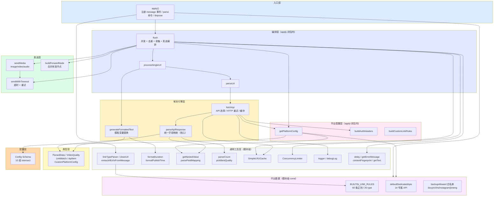
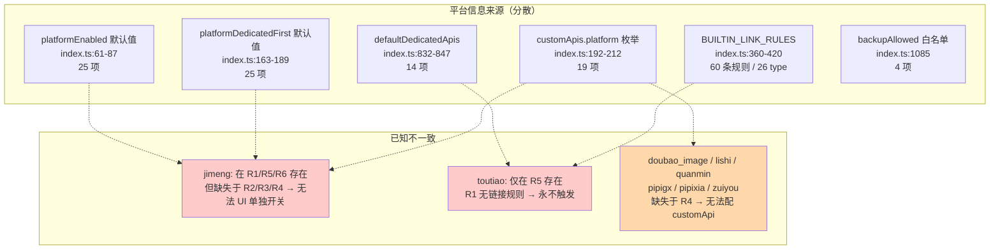

# 架构 / 模块依赖图

描述当前（单文件）版本的逻辑分层与依赖关系。源码位置：`src/index.ts`（1238 行）。

## 逻辑分层



## 数据流（端到端）

```mermaid
flowchart LR
    Msg["用户消息<br/>(文本/XML卡片/JSON卡片)"]
    Match["LinkMatch[]<br/>{type,url,id}"]
    Conf["PlatformConf<br/>{apiUrl,dedicatedFirst,...}"]
    Raw["API 原始响应<br/>(任意结构)"]
    Parsed["ParsedData<br/>(统一结构)"]
    Text["格式化文字"]
    Send["发送<br/>(文字/图/视频/语音/转发)"]

    Msg -->|extractAllUrlsFromMessage| Match
    Match -->|getPlatformConfig| Conf
    Match -->|flush → processSingleUrl| Raw
    Conf -.->|决定 apiList 顺序| Raw
    Raw -->|parseApiResponse +<br/>fieldMapping| Parsed
    Parsed -->|generateFormattedText| Text
    Parsed -->|sendMedia / 转发| Send
    Text --> Send

    style Parsed fill:#fef3c7
    style Conf fill:#fce7f3
```



## 平台数据的分散现状（待拆分统一）

当前平台信息散落在 6 处，存在不一致（拆分阶段将建立统一注册表）：



## 当前文件结构

```
koishi-plugin-video-parser-all/
├── src/
│   └── index.ts          # 全部逻辑（1238 行，apply 占 462 行）
├── package.json
├── tsconfig.json
└── readme.md
```

> 本图为「拆分前」基线。拆分后将更新为多模块结构（见后续提交）。
