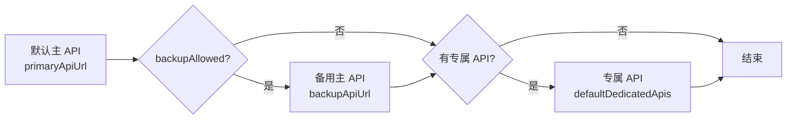
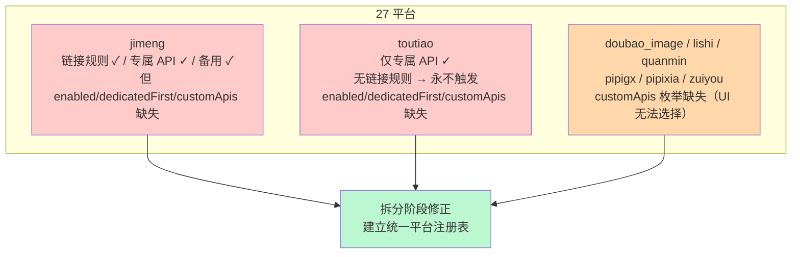

# 平台数据卡总览

本插件支持 27 个内置平台。**所有平台共享同一套解析引擎**（`parseApiResponse`，统一字段映射 + fallback 容错），平台间的差异**仅体现在数据**：链接匹配规则、专属 API、是否允许备用 API、开关默认值。

每个平台对应同目录下一个 `.md` 数据卡，含基本信息表、链接规则原文与该平台的解析流程时序图。

## 平台总览表

| # | ID | 中文名 | 解析能力 | 专属 API | 备用 API | enabled | dedicatedFirst | customApis | 备注 |
|---|----|--------|----------|----------|----------|---------|----------------|------------|------|
| 1 | `bilibili` | [哔哩哔哩](bilibili.md) | 视频 | ✓ | ✗ | ✓ | ✓ | ✓ | |
| 2 | `douyin` | [抖音](douyin.md) | 短视频/图集/实况 | ✓ | ✓ | ✓ | ✓ | ✓ | 备用允许 |
| 3 | `kuaishou` | [快手](kuaishou.md) | 短视频/图集 | ✓ | ✗ | ✓ | ✓ | ✓ | |
| 4 | `xiaohongshu` | [小红书](xiaohongshu.md) | 图文/视频 | ✓ | ✓ | ✓ | ✓ | ✓ | 备用允许 |
| 5 | `weibo` | [微博](weibo.md) | 视频/图集 | ✓ | ✗ | ✓ | ✓ | ✓ | |
| 6 | `xigua` | [西瓜视频](xigua.md) | 短视频 | ✗ | ✗ | ✓ | ✓ | ✓ | 仅主 API |
| 7 | `youtube` | [YouTube](youtube.md) | 视频 | ✗ | ✗ | ✓ | ✓ | ✓ | 仅主 API |
| 8 | `tiktok` | [TikTok](tiktok.md) | 短视频 | ✗ | ✗ | ✓ | ✓ | ✓ | 仅主 API |
| 9 | `acfun` | [AcFun（A站）](acfun.md) | 视频 | ✗ | ✗ | ✓ | ✓ | ✓ | 仅主 API |
| 10 | `zhihu` | [知乎](zhihu.md) | 视频 | ✗ | ✗ | ✓ | ✓ | ✓ | 仅主 API |
| 11 | `weishi` | [微视](weishi.md) | 短视频 | ✗ | ✗ | ✓ | ✓ | ✓ | 仅主 API |
| 12 | `huya` | [虎牙](huya.md) | 直播回放/视频 | ✓ | ✗ | ✓ | ✓ | ✓ | |
| 13 | `haokan` | [好看视频](haokan.md) | 短视频 | ✗ | ✗ | ✓ | ✓ | ✓ | 仅主 API |
| 14 | `meipai` | [美拍](meipai.md) | 短视频 | ✗ | ✗ | ✓ | ✓ | ✓ | 仅主 API |
| 15 | `twitter` | [Twitter/X](twitter.md) | 视频/图文 | ✗ | ✗ | ✓ | ✓ | ✓ | 仅主 API |
| 16 | `instagram` | [Instagram](instagram.md) | 图文/Reels | ✗ | ✓ | ✓ | ✓ | ✓ | 备用允许（无专属） |
| 17 | `doubao` | [豆包（视频）](doubao.md) | 视频 | ✓ | ✗ | ✓ | ✓ | ✓ | |
| 18 | `doubao_image` | [豆包（图集）](doubao_image.md) | 图文 | ✓ | ✗ | ✓ | ✓ | ✗ | customApis 枚举缺失 |
| 19 | `jimeng` | [即梦](jimeng.md) | AI视频/AI图片 | ✓ | ✓ | ⚠️ | ⚠️ | ⚠️ | 开关/枚举缺失（待修正） |
| 20 | `oasis` | [绿洲](oasis.md) | 视频/图文 | ✗ | ✗ | ✓ | ✓ | ✓ | 仅主 API |
| 21 | `wechat_channel` | [视频号](wechat_channel.md) | 短视频 | ✓ | ✗ | ✓ | ✓ | ✓ | |
| 22 | `lishi` | [梨视频](lishi.md) | 短视频 | ✗ | ✗ | ✓ | ✓ | ✗ | customApis 枚举缺失 |
| 23 | `quanmin` | [全民直播](quanmin.md) | 直播 | ✗ | ✗ | ✓ | ✓ | ✗ | customApis 枚举缺失 |
| 24 | `pipigx` | [皮皮搞笑](pipigx.md) | 短视频 | ✓ | ✗ | ✓ | ✓ | ✗ | customApis 枚举缺失 |
| 25 | `pipixia` | [皮皮虾](pipixia.md) | 短视频 | ✓ | ✗ | ✓ | ✓ | ✗ | customApis 枚举缺失 |
| 26 | `zuiyou` | [最右](zuiyou.md) | 短视频 | ✓ | ✗ | ✓ | ✓ | ✗ | customApis 枚举缺失 |
| 27 | `toutiao` | [今日头条](toutiao.md) | 视频 | ✓ | ✗ | ⚠️ | ⚠️ | ⚠️ | **无链接规则，永不触发**（待修正） |

图例：✓ 有/默认开启｜✗ 无｜⚠️ 数据缺失（见下方说明）

## 字段说明

- **专属 API**：`defaultDedicatedApis[type]`，存在则可走专属接口（由 `platformDedicatedFirst[type]` 决定顺序）
- **备用 API**：是否在 `backupAllowed` 白名单（`['douyin','xiaohongshu','instagram','jimeng']`），即 `backupApiUrl`
- **enabled**：是否出现在 `platformEnabled` 开关表（默认 true）
- **dedicatedFirst**：是否出现在 `platformDedicatedFirst` 开关表（默认 false）
- **customApis**：是否出现在 `customApis.platform` 枚举（影响 UI 下拉，不影响运行时）

## API 选择顺序（默认 `dedicatedFirst=false`）

> 若用户将某平台 `platformDedicatedFirst[type]` 设为 true，则顺序变为：专属 API → 主 API → 备用 API。

## 字段映射来源

所有内置平台**均无专属字段映射**，统一使用配置项 `globalFieldMapping`（将 API 响应的 `data.title`、`data.author.name`、`data.statistics.*` 等映射到 `ParsedData` 字段）。

用户可通过以下方式覆盖：
- `customApis[].fieldMapping`：为某内置平台提供专属映射
- `customPlatforms[].fieldMapping`：为自定义平台提供映射

详见 [通用类图 - parseApiResponse](../diagrams/02-class-general.md)。

## 已知不一致（拆分阶段将修正）

各平台数据卡：
[哔哩哔哩](bilibili.md) · [抖音](douyin.md) · [快手](kuaishou.md) · [小红书](xiaohongshu.md) · [微博](weibo.md) · [西瓜视频](xigua.md) · [YouTube](youtube.md) · [TikTok](tiktok.md) · [AcFun](acfun.md) · [知乎](zhihu.md) · [微视](weishi.md) · [虎牙](huya.md) · [好看视频](haokan.md) · [美拍](meipai.md) · [Twitter](twitter.md) · [Instagram](instagram.md) · [豆包视频](doubao.md) · [豆包图集](doubao_image.md) · [即梦](jimeng.md) · [绿洲](oasis.md) · [视频号](wechat_channel.md) · [梨视频](lishi.md) · [全民直播](quanmin.md) · [皮皮搞笑](pipigx.md) · [皮皮虾](pipixia.md) · [最右](zuiyou.md) · [今日头条](toutiao.md)
