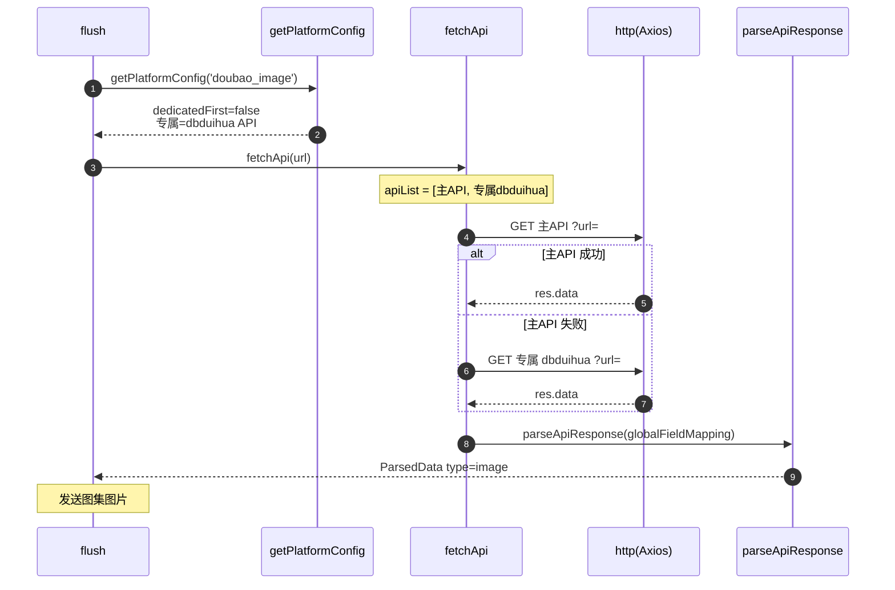

# 豆包（图集）（`doubao_image`）

> 平台数据卡。本平台与所有平台共享统一解析引擎 `parseApiResponse`，差异见下。

## 基本信息

| 项 | 值 |
|---|---|
| 平台 ID | `doubao_image` |
| 中文名 | 豆包（图集） |
| 解析能力 | 图文 |
| 专属 API | `https://api.bugpk.com/api/dbduihua` |
| 备用 API | 不允许 |
| 字段映射 | 全局 `globalFieldMapping`（无专属） |
| `platformEnabled` 默认 | `true` |
| `platformDedicatedFirst` 默认 | `false` |
| `customApis` 可配置 | ⚠️ 缺失（不在 `customApis.platform` 枚举，UI 无法选择；运行时仍可被 `getPlatformConfig` 识别） |

## 链接匹配规则

`BUILTIN_LINK_RULES` 中归属 `doubao_image`（`index.ts:402`）：

```js
/https?:\/\/(?:www\.)?doubao\.com\/thread\/[^\s'"“”‘’]+/gi
```

## 解析流程时序图

`dedicatedFirst=false`（默认），顺序：主 API → 专属 API（无备用）。


