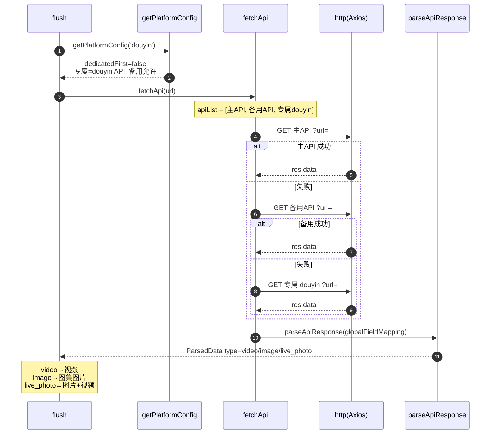

# 抖音（`douyin`）

> 平台数据卡。本平台与所有平台共享统一解析引擎 `parseApiResponse`，差异见下。

## 基本信息

| 项 | 值 |
|---|---|
| 平台 ID | `douyin` |
| 中文名 | 抖音 |
| 解析能力 | 短视频 / 图集 / 实况（Live Photo） |
| 专属 API | `https://api.bugpk.com/api/douyin` |
| 备用 API | **允许**（在 `backupAllowed` 白名单） |
| 字段映射 | 全局 `globalFieldMapping`（无专属） |
| `platformEnabled` 默认 | `true` |
| `platformDedicatedFirst` 默认 | `false` |
| `customApis` 可配置 | 是 |

## 链接匹配规则

`BUILTIN_LINK_RULES` 中归属 `douyin`（`platforms/rules.ts`）：

```js
/https?:\/\/(?:www\.)?douyin\.com\/video\/\d{10,}/gi
/https?:\/\/v\.douyin\.com\/[0-9a-zA-Z_\/-]+/gi
```

## 解析流程时序图

`dedicatedFirst=false`（默认），顺序：主 API → 备用 API → 专属 API。


