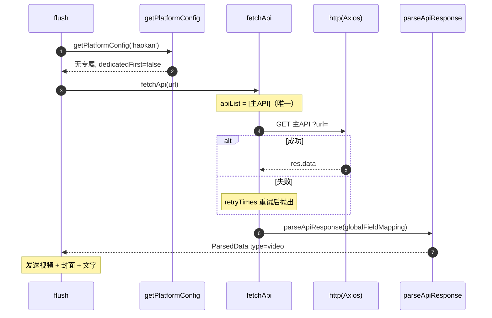

# 好看视频（`haokan`）

> 平台数据卡。本平台与所有平台共享统一解析引擎 `parseApiResponse`，差异见下。

## 基本信息

| 项 | 值 |
|---|---|
| 平台 ID | `haokan` |
| 中文名 | 好看视频 |
| 解析能力 | 短视频 |
| 专属 API | 无 |
| 备用 API | 不允许 |
| 字段映射 | 全局 `globalFieldMapping`（无专属） |
| `platformEnabled` 默认 | `true` |
| `platformDedicatedFirst` 默认 | `false` |
| `customApis` 可配置 | 是 |

## 链接匹配规则

`BUILTIN_LINK_RULES` 中归属 `haokan`（`index.ts:393`）：

```js
/https?:\/\/haokan\.baidu\.com\/v\?vid=[0-9a-zA-Z_\/-]+/gi
```

## 解析流程时序图

无专属 API、无备用，仅主 API。


