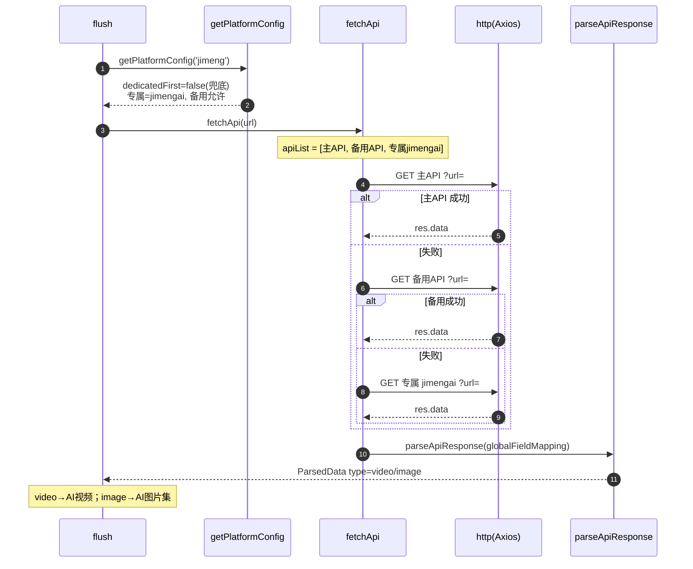

# 即梦（`jimeng`）

> 平台数据卡。本平台与所有平台共享统一解析引擎 `parseApiResponse`，差异见下。

## 基本信息

| 项 | 值 |
|---|---|
| 平台 ID | `jimeng` |
| 中文名 | 即梦（AI 视频 / AI 图片，Dreamina） |
| 解析能力 | AI 视频 / AI 图片 |
| 专属 API | `https://api.bugpk.com/api/jimengai` |
| 备用 API | **允许**（在 `backupAllowed` 白名单） |
| 字段映射 | 全局 `globalFieldMapping`（无专属） |
| `platformEnabled` 默认 | ⚠️ **缺失**（不在开关表，`?? true` 兜底为启用） |
| `platformDedicatedFirst` 默认 | ⚠️ **缺失**（不在开关表，`?? false` 兜底为 false） |
| `customApis` 可配置 | ⚠️ 缺失（不在 `customApis.platform` 枚举） |

> ⚠️ 数据不一致：`jimeng` 在链接规则、专属 API、备用白名单中均存在，但缺失于 `platformEnabled` / `platformDedicatedFirst` / `customApis` 三处。用户无法通过 UI 单独开关或配置自定义 API。**拆分阶段将修正**。

## 链接匹配规则

`BUILTIN_LINK_RULES` 中归属 `jimeng`（`index.ts:403-406`）：

```js
/https?:\/\/(?:www\.)?jimeng\.jianying\.com\/[^\s'"“”‘’]*/gi
/https?:\/\/(?:www\.)?jimeng\.cn\/[^\s'"“”‘’]*/gi
/https?:\/\/(?:www\.)?dreamina\.jianying\.com\/[^\s'"“”‘’]*/gi
/https?:\/\/(?:www\.)?dreamina\.capcut\.com\/[^\s'"“”‘’]*/gi
```

## 解析流程时序图

`dedicatedFirst` 兜底为 `false`，顺序：主 API → 备用 API → 专属 API。


