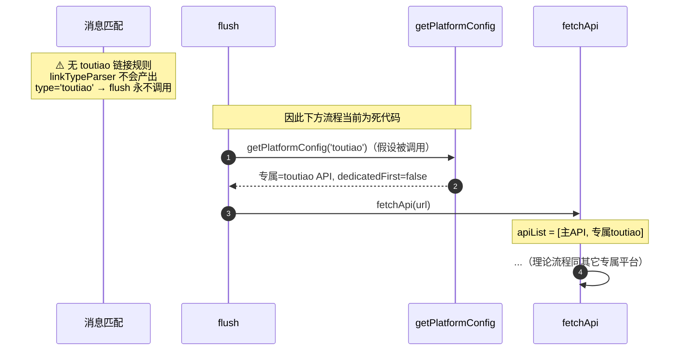

# 今日头条（`toutiao`）

> 平台数据卡。本平台与所有平台共享统一解析引擎 `parseApiResponse`，差异见下。

## 基本信息

| 项 | 值 |
|---|---|
| 平台 ID | `toutiao` |
| 中文名 | 今日头条 |
| 解析能力 | 视频（推测） |
| 专属 API | `https://api.bugpk.com/api/toutiao` |
| 备用 API | 不允许 |
| 字段映射 | 全局 `globalFieldMapping`（无专属） |
| `platformEnabled` 默认 | ⚠️ **缺失** |
| `platformDedicatedFirst` 默认 | ⚠️ **缺失** |
| `customApis` 可配置 | ⚠️ 缺失 |
| **链接匹配规则** | ⚠️ **无**（`BUILTIN_LINK_RULES` 中不存在 `toutiao`） |

> ⚠️ **重大不一致**：`toutiao` 仅存在于 `defaultDedicatedApis`（专属 API 表，`index.ts:840`），但 `BUILTIN_LINK_RULES` 中**没有任何匹配到 `toutiao` 的正则规则**。因此消息匹配阶段（`linkTypeParser`）永远不会产生 `type='toutiao'` 的 `LinkMatch`，该专属 API **实际上是不可达的死数据**。
>
> 此外它也缺失于 `platformEnabled` / `platformDedicatedFirst` / `customApis` 三处。**拆分阶段将修正**（补充链接规则或移除死数据，以统一注册表为准）。

## 链接匹配规则

**无**。`BUILTIN_LINK_RULES` 中找不到 `toutiao`（对比其他平台均有 1~5 条正则）。

## 解析流程时序图（理论可达路径 / 当前实际不可达）

下图展示「假如」存在链接规则时的流程；当前由于无规则，`flush` 中不会出现 `type='toutiao'`。

## 修正建议（拆分阶段）

建立统一平台注册表时二选一：
- **方案 A（补全）**：为 `toutiao` 添加链接规则（如 `toutiao.com/video/` 等），并在开关表中补齐，使其真正可用
- **方案 B（移除）**：从 `defaultDedicatedApis` 删除 `toutiao`，消除死数据
