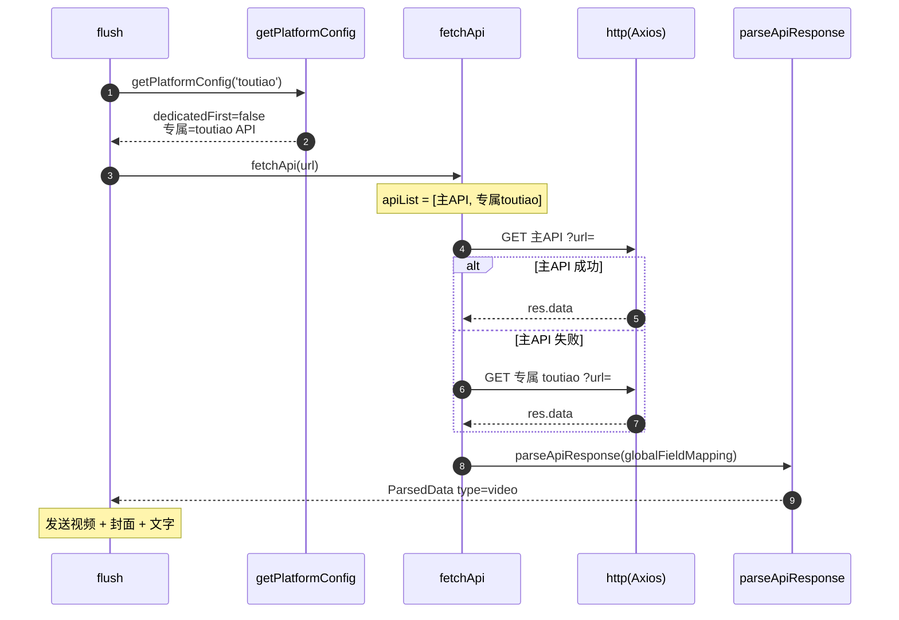

# 今日头条（`toutiao`）

> 平台数据卡。本平台与所有平台共享统一解析引擎 `parseApiResponse`，差异见下。

## 基本信息

| 项 | 值 |
|---|---|
| 平台 ID | `toutiao` |
| 中文名 | 今日头条 |
| 解析能力 | 视频（推测） |
| 专属 API | `https://api.bugpk.com/api/toutiao` |
| 备用 API | 不允许 |
| 字段映射 | 全局 `globalFieldMapping`（无专属） |
| `platformEnabled` 默认 | `true` |
| `platformDedicatedFirst` 默认 | `false` |
| `customApis` 可配置 | 是 |
| **链接匹配规则** | 已补全（`toutiao.com/video/`） |

> 历史版本中 `toutiao` 仅存在于 `defaultDedicatedApis`（专属 API 表），既无链接规则也缺失于三处开关/枚举，是**不可达的死数据**。**已修正**：补全了 `toutiao.com/video/` 链接规则，并在 `platformEnabled` / `platformDedicatedFirst` / `customApis` 中补齐，现可被正常识别与解析。

## 链接匹配规则

`BUILTIN_LINK_RULES` 中归属 `toutiao`：

```js
/https?:\/\/(?:www\.|m\.)?toutiao\.com\/video\/\d+/gi
```

## 解析流程时序图

`dedicatedFirst=false`（默认），顺序：主 API → 专属 API（无备用）。


