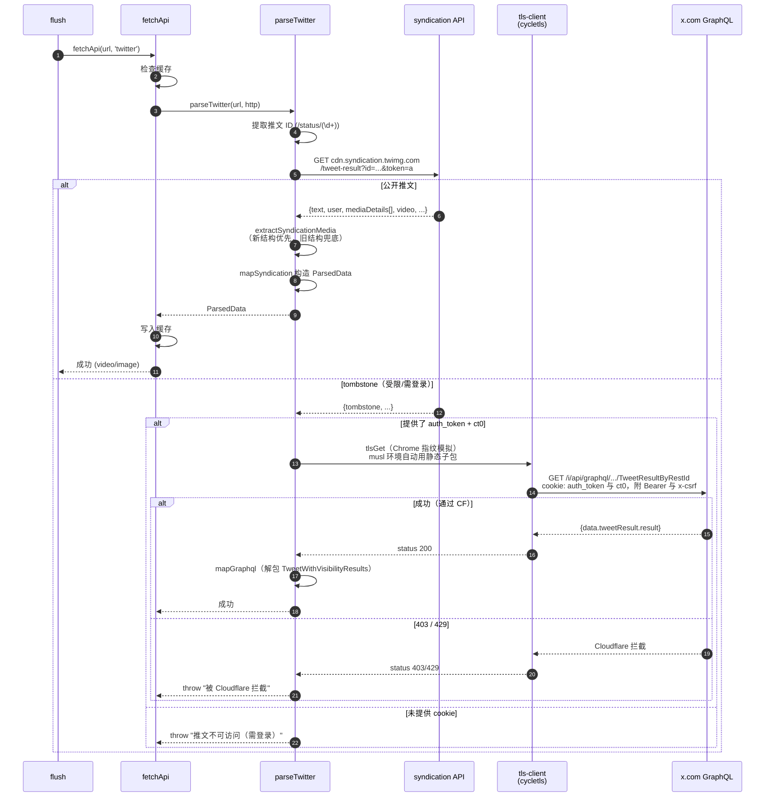

# Twitter / X（`twitter`）

> 平台数据卡。X **不走统一解析网关**（旧 bugpk / 新 api-new.ifphp.com 均不支持 twitter），改用原生解析器。

## 基本信息

| 项 | 值 |
|---|---|
| 平台 ID | `twitter` |
| 中文名 | Twitter / X |
| 解析能力 | 视频 / 图文（含需登录/NSFW 推文） |
| 解析方式 | **原生 syndication API**（公开推文，无需登录）+ **GraphQL 鉴权回退**（需登录推文） |
| 统一网关 | ✗ 不支持（主 API 返回"无法识别平台"） |
| 备用 API | 不允许 |
| 字段映射 | 不适用（原生解析直接构造 `ParsedData`） |
| `platformEnabled` 默认 | `true` |
| `platformDedicatedFirst` 默认 | `false` |
| `customApis` 可配置 | 是（若配置则覆盖原生解析，走自定义 API） |

> **登录态解析**：X 的 syndication API 仅返回公开推文；需登录/NSFW 推文走 **GraphQL 鉴权回退**（`TweetResultByRestId`，仅用 `auth_token` + `ct0` 两个 cookie，最小化）。
>
> X 的 GraphQL 端点受 Cloudflare TLS 指纹校验保护，普通 Node/axios 会被 403。插件用 **cycletls**（`src/utils/tls-client.ts`，基于 utls 的 Chrome 指纹模拟，`optionalDependency`）发起 GraphQL 请求，从而通过 CF。
>
> **运行环境要求与自愈**（`src/utils/tls-client.ts`）：
> - 初始化前预检：二进制缺失/损坏秒报错；Linux/macOS 缺执行位自动 `chmod 755`；exec 探针（spawnSync）先行验证，环境拒绝执行（EPERM/EACCES）时干净报错，绕开 cycletls 在事件回调里 throw 击溃宿主进程的缺陷
> - **musl/Alpine 环境**：官方包的 glibc 二进制会 exec 报 ENOENT（ELF 解释器缺失），自动改用静态构建子包 `@char46/cycletls-linux-musl-x64`（本插件可选依赖，版本与 npm cycletls 对应）
> - 诊断：配置 X 凭证后插件加载即自动自检并输出日志；或在配置中开启 `enableDiagCommand` 后用 `parse/diag` 在聊天内查看（免 shell）
>
> **配置**：插件 `twitterAuthToken` + `twitterCt0`；CLI `--twitter-auth-token` + `--twitter-ct0`。

## 链接匹配规则

`BUILTIN_LINK_RULES` 中归属 `twitter`（`platforms/rules.ts`）：

```js
/https?:\/\/twitter\.com\/\w+\/status\/\d{10,}/gi
/https?:\/\/x\.com\/\w+\/status\/\d{10,}/gi
```

> 注意：规则要求状态 ID 至少 10 位数字（真实推文 ID 为 18~19 位）。

## 解析流程时序图

`fetchApi` 检测到 `type === 'twitter'` 且用户未自定义 API 时，路由到 `parseTwitter` 原生解析。



## 字段映射

**syndication → ParsedData**（`mapSyndication`，1.8.5 起媒体提取新结构优先）

媒体提取顺序（`extractSyndicationMedia`）：

1. `mediaDetails[]`（新结构标准位置）：`type=photo` → `images`；`type=video/animated_gif` 的 `video_info.variants` → `videos`（按 bitrate 降序）
2. 顶层 `video.variants`（amplify 等场景，字段为 `src` 而非 `url`，海报为 `poster`）
3. 旧结构兜底：`videoDetails.variants` + `photos[]`

| syndication 字段 | ParsedData 字段 |
|-----------------|-----------------|
| `text` / `note_tweet.text` | `title`（前 100 字）+ `desc` |
| `user.screen_name` / `user.name` | `uid` / `author` |
| `user.profile_image_url_https` | `avatar` |
| `user.followers_count` / `description` | `author_followers` / `author_signature` |
| `mediaDetails[type=photo].media_url_https` | `images`（新结构优先） |
| `mediaDetails[video].video_info.variants` / `video.variants`（按 bitrate 降序） | `videos` + `video`（最高码率） |
| `mediaDetails[video].media_url_https` / `video.poster` | `cover`（视频海报） |
| `video_info.duration_millis` / `video.durationMs` | `duration`（秒） |
| `video.viewCount`（新）→ `videoDetails.viewCount`（旧）→ `views` | `play` |
| `photos[].url`（旧结构兜底） | `images` |
| `favorite_count` / `conversation_count` / `retweet_count` | `like` / `comment` / `share` |
| `created_at`（ISO） | `publishTime`（毫秒） |

**GraphQL TweetResultByRestId → ParsedData**（`mapGraphql`）

| GraphQL 字段 | ParsedData 字段 |
|--------------|-----------------|
| `legacy.full_text` / `note_tweet...text` | `title` + `desc` |
| `core.user_results.result.legacy.screen_name` | `uid` |
| `core.user_results.result.legacy.name` | `author` |
| `legacy.entities.media[type=photo].media_url_https` | `images` |
| `legacy.entities.media[type=video].video_info.variants`（mp4，按 bitrate 降序） | `videos` + `video` |
| `media.media_url_https` | `cover`（视频海报） |
| `result.views.count` | `play` |
| `legacy.favorite_count` / `reply_count` / `retweet_count` / `bookmark_count` | `like` / `comment` / `share` / `collect` |
| `legacy.created_at`（RFC822） | `publishTime`（毫秒） |
