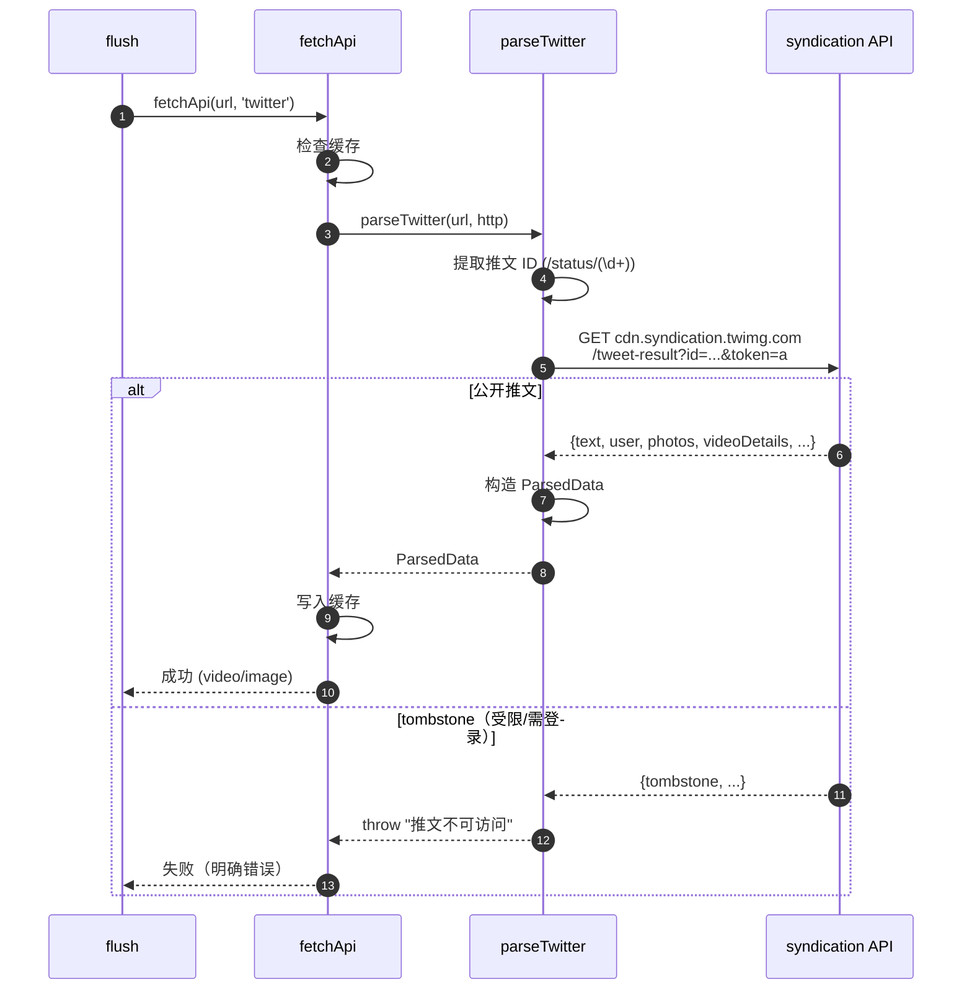

# Twitter / X（`twitter`）

> 平台数据卡。X **不走 bugpk 统一 API**（统一 API 不支持 twitter），改用原生 syndication 解析器。

## 基本信息

| 项 | 值 |
|---|---|
| 平台 ID | `twitter` |
| 中文名 | Twitter / X |
| 解析能力 | 视频 / 图文 |
| 解析方式 | **原生 syndication API**（`platforms/twitter.ts`，无需登录即可解析公开推文） |
| bugpk 统一 API | ✗ 不支持（主 API 返回"无法识别平台"） |
| 备用 API | 不允许 |
| 字段映射 | 不适用（原生解析直接构造 `ParsedData`） |
| `platformEnabled` 默认 | `true` |
| `platformDedicatedFirst` 默认 | `false` |
| `customApis` 可配置 | 是（若配置则覆盖原生解析，走自定义 API） |

> ⚠️ **登录限制**：X 的 syndication API 仅返回**公开**推文。当推文受限/需登录/已删除时，API 返回 `tombstone`，插件会抛出明确错误"推文不可访问（可能需要登录…）"。此类推文无法在无 X 凭据的情况下解析。

## 链接匹配规则

`BUILTIN_LINK_RULES` 中归属 `twitter`（`platforms/rules.ts`）：

```js
/https?:\/\/twitter\.com\/\w+\/status\/\d{10,}/gi
/https?:\/\/x\.com\/\w+\/status\/\d{10,}/gi
```

> 注意：规则要求状态 ID 至少 10 位数字（真实推文 ID 为 18~19 位）。

## 解析流程时序图

`fetchApi` 检测到 `type === 'twitter'` 且用户未自定义 API 时，路由到 `parseTwitter` 原生解析。



## 字段映射（syndication → ParsedData）

| syndication 字段 | ParsedData 字段 |
|-----------------|-----------------|
| `text` / `note_tweet.text` | `title`（前 100 字）+ `desc` |
| `user.screen_name` | `uid` |
| `user.name` | `author` |
| `user.profile_image_url_https` | `avatar` |
| `user.followers_count` / `description` | `author_followers` / `author_signature` |
| `photos[].url` | `images` |
| `videoDetails.variants[]`（按 bitrate 降序） | `videos` + `video`（最高码率） |
| `videoDetails.posterUrl` | `cover` |
| `videoDetails.durationMs` | `duration`（秒） |
| `videoDetails.viewCount` | `play` |
| `favorite_count` / `conversation_count` / `retweet_count` | `like` / `comment` / `share` |
| `created_at`（ISO） | `publishTime`（毫秒） |
