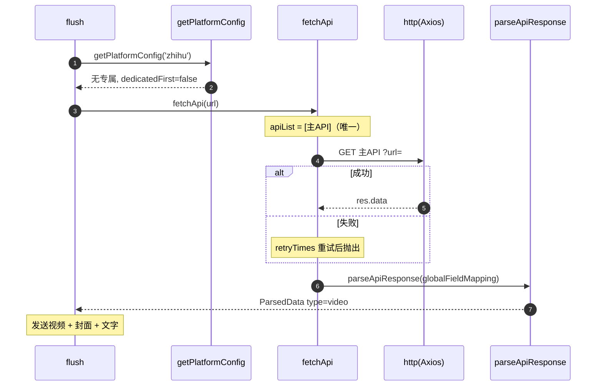

# 知乎（`zhihu`）

> 平台数据卡。本平台与所有平台共享统一解析引擎 `parseApiResponse`，差异见下。

## 基本信息

| 项 | 值 |
|---|---|
| 平台 ID | `zhihu` |
| 中文名 | 知乎 |
| 解析能力 | 视频（含回答中的视频） |
| 专属 API | 无 |
| 备用 API | 不允许 |
| 字段映射 | 全局 `globalFieldMapping`（无专属） |
| `platformEnabled` 默认 | `true` |
| `platformDedicatedFirst` 默认 | `false` |
| `customApis` 可配置 | 是 |

## 链接匹配规则

`BUILTIN_LINK_RULES` 中归属 `zhihu`（`platforms/rules.ts`）：

```js
/https?:\/\/(?:www\.)?zhihu\.com\/video\/\d{10,}/gi
/https?:\/\/(?:www\.|m\.)?zhihu\.com\/question\/\d+\/answer\/\d+/gi
/https?:\/\/zhuanlan\.zhihu\.com\/p\/\d+/gi
/https?:\/\/(?:www\.|m\.)?zhihu\.com\/zvideo\/\d+/gi
```

## 解析流程时序图

无专属 API、无备用，仅主 API。


